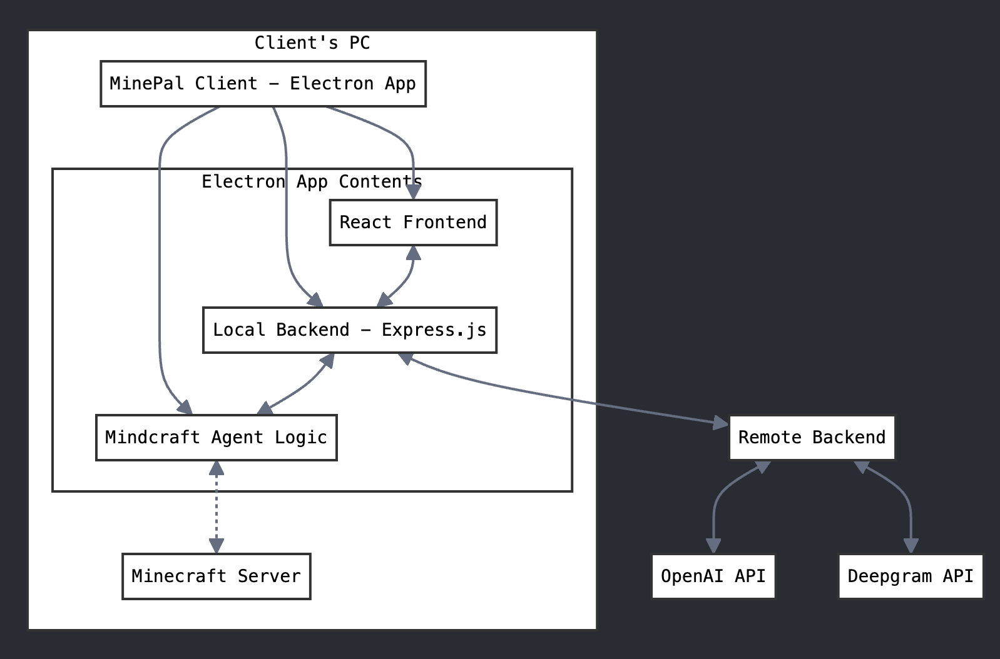

# MinePal

## Overview

MinePal is a desktop Minecraft companion app built with Electron that adds an AI agent to your Minecraft world.

## Structure



- **Frontend**: Located in `frontend/`, built with React and Vite.
- **Agent**: Minecraft agent logic in `src/agent/`.
- **Libraries**: Located in `libs/`, contains several submodules:
  - `node-minecraft-protocol-forge/`
  - `mineflayer-collectblock/`
  - `mineflayer-auto-eat/`
  - `mineflayer-pvp/`
  - `prismarine-world/`
  - `mineflayer/`
  - `minecraft-protocol/`

## Setup

### Prerequisites

- [Node.js](https://nodejs.org/) (v14 or later)
- [Electron](https://www.electronjs.org/)

### Installation

> [!NOTE]
> Steps 2-5 can be skipped by running `setup.sh` script

1. Clone the repository

> [!WARNING]
> This project contains submodules. Use `--recurse-submodules` when cloning. If you're getting `ERESOLVE unable to resolve dependency tree` error, it means that you did not use this flag.

2. Install dependencies:

   ```sh
   npm install
   ```

3. Install and build submodules:

   ```sh
   cd libs
   for dir in */; do
     cd "$dir"
     npm install
     if [ -f "package.json" ] && grep -q "\"build\"" "package.json"; then
       npm run build
     fi
     if [ -f "package.json" ] && grep -q "\"prepare\"" "package.json"; then
       npm run prepare
     fi
     cd ..
   done
   cd ..
   ```

4. Build the frontend:
```sh
cd frontend
npm install
npm run build
```

5. Build the app:

   ```sh
   npm run buildLocal
   ```

### Running the App

```sh
npm start
```

### Agent

1. Navigate to `src/agent/`.
2. Actions that the bot can take are in `src/agent/commands/actions.js` or `src/agent/commands/queries.js`.

## License

MIT
